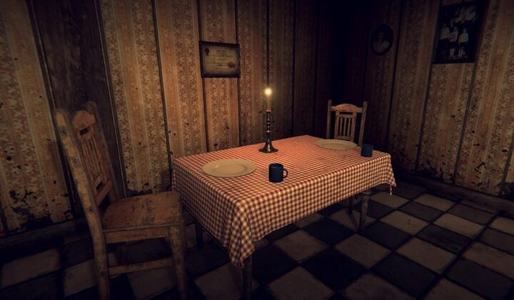

# Proyecto: Escape Room con Python

¡Bienvenido, Jesús! Este proyecto ofrece un sencillo juego de tipo "Escape Room" escrito en Python, en el que tendrás que encontrar llaves, abrir puertas y escapar antes de que se agote el tiempo.

---

## 1. Introducción

En este juego despertarás en una casa extraña y deberás explorar varias habitaciones, recolectar objetos y descubrir la forma de escapar. El desafío principal consiste en encontrar las llaves adecuadas para abrir las puertas que te conducirán fuera de la casa, todo antes de que se agote el temporizador de 5 minutos.

---

## 2. Instalación

1. Asegúrate de tener instalado **Python 3.x**.
2. (Opcional) Instala [Jupyter Notebook](https://jupyter.org/) o ejecuta el proyecto en un entorno compatible con notebooks (por ejemplo, Google Colab).
3. Clona o descarga este repositorio en tu máquina local.
4. Desde tu terminal, ubícate en la carpeta del proyecto y ejecuta:

``` python
pip install -r requirements.txt
```

*(En caso de que exista un archivo requirements.txt con las dependencias. Si no, asegúrate de instalar manualmente las librerías que necesites, como `IPython` para mostrar imágenes).*

---

## 3. Mapa del juego

A continuación se muestra el esquema de las habitaciones y su disposición:


En este mapa podrás visualizar la conexión entre las distintas habitaciones de la casa.

---

## 4. Descripción de las Habitaciones

El juego incluye cinco escenarios principales, cada uno con su propia imagen de referencia:

1. **Sala de Estar (Living Room)**  
  
*(También se hace referencia a esta imagen en #file:limages/iving_room.jpg, en caso de que sea un archivo alternativo o con diferente resolución.)*

2. **Sala de Juegos (Game Room)**  
  
Aquí comienzas tu aventura, con un piano, un sofá y la primera puerta que deberás desbloquear.

3. **Dormitorio 1 (Bedroom 1)**  
  
Encontrarás una cama y varias puertas de conexión.

4. **Dormitorio 2 (Bedroom 2)**  
  
Una segunda habitación que contiene otra cama y un mueble donde podrías encontrar objetos útiles.

5. **Exterior (Outside)**  
  
Tu objetivo final es llegar aquí antes de que se acabe el tiempo.

---

## 5. Estructura de Archivos y Código

- **#file:escape-room.ipynb**  
Es el punto de entrada principal del juego en Jupyter Notebook (o un notebook equivalente). Aquí se definen las habitaciones, las llaves y la función que inicia el juego (`start_game`). Desde este archivo puedes ejecutar todas las celdas para comenzar a jugar.

- **#file:functions.py**  
Contiene las funciones y la lógica base del juego. Algunas de sus partes clave:
- `start_game(game_state, object_relations)`: Inicia el juego y lanza el temporizador en un hilo independiente.
- `play_room(game_state, room, object_relations)`: Gestiona la interacción del jugador con cada habitación.
- `examine_item(game_state, item_name, object_relations)`: Permite inspeccionar objetos y recoger llaves.
- `start_timer()`: Controla la cuenta regresiva de 5 minutos. Si el tiempo se agota, el juego termina.

Estas funciones trabajan juntas para ofrecer una experiencia de "Escape Room" en tiempo real. Mientras exploras, podrás ver el tiempo restante en pantalla y, si no logras salir antes de que el contador llegue a cero, perderás la partida.

---

## 6. ¿Cómo Jugar?

1. Ejecuta el notebook **escape-room.ipynb** (o **main.ipynb**, según la versión que tengas en tu repositorio) desde tu entorno de Python/Jupyter.
2. Al iniciarse el juego, se mostrará un texto introductorio y comenzarás en la *Game Room*.
3. Escribe `explore` para explorar la habitación, verás un listado de objetos que puedes examinar.
4. Escribe `examine` para inspeccionar un objeto específico. Si encuentras una llave, se guardará en tu inventario.
5. Usa las llaves para abrir puertas bloqueadas y moverte a otras habitaciones.
6. El objetivo principal es llegar a la habitación `outside` antes de que el contador de 5 minutos llegue a cero.

¡Disfruta del desafío y buena suerte escapando a tiempo!
